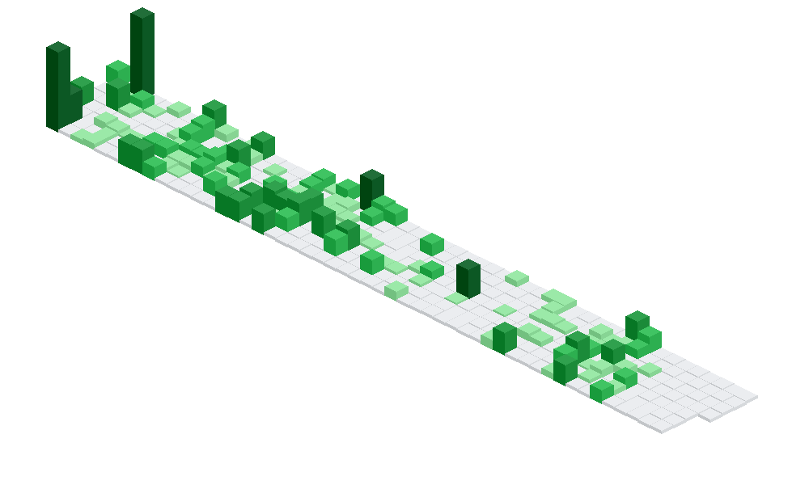

# Isometric Contributions Generator

Generate beautiful 3D isometric visualizations of GitHub contribution graphs from any GitHub profile.



## Features

- 🎨 Generates isometric 3D pixel art from GitHub contribution data
- 📊 Fetches real-time contribution data from GitHub
- 🖼️ Exports high-quality PNG images
- 📈 Calculates contribution statistics (streaks, totals, averages)
- 🎯 Works with any public GitHub profile
- ⚡ Fast rendering with node-canvas

## Installation

```bash
npm install
```

## Usage

### Generate an Image

Generate an isometric contribution graph for any GitHub user:

```bash
npm run generate -- <username> [year] [output]
```

**Examples:**

```bash
# Generate current year for a user
npm run generate -- octocat

# Generate for a specific year
npm run generate -- octocat 2025

# Specify custom output filename
npm run generate -- octocat 2025 my-graph.png
```

Or use the script directly:

```bash
node generate.js spectrewolf8 2025 output.png
```

### Test the API

Test fetching contribution data without generating an image:

```bash
npm run test:api -- <username> [year]
```

## API

### API Client (`src/api-client.js`)

```javascript
import { fetchContributions, parseContributionsData } from './src/api-client.js'

// Fetch contribution data
const data = await fetchContributions('username', 2025)

// Parse into usable format
const days = parseContributionsData(data)
// Returns: [{date: Date, count: number, level: number, week: number, color: string}, ...]
```

### Renderer (`src/renderer.js`)

```javascript
import { renderIsometricChart, calculateStats, exportToPNG } from './src/renderer.js'

// Render to canvas
const canvas = renderIsometricChart(days, {
  width: 1000,
  height: 600
})

// Calculate statistics
const stats = calculateStats(days)

// Export to PNG
const buffer = exportToPNG(canvas)
```

## Output

The generator creates PNG images with:

- **Resolution**: 1000x600 pixels (configurable)
- **Format**: PNG with transparency
- **Size**: Typically 20-30 KB
- **Quality**: High-quality isometric pixel art

### Statistics Calculated

- Total contributions for the year
- Best day (max contributions in a single day)
- Average contributions per day
- Longest streak
- Current streak
- Weekly totals

## Project Structure

```
src/
  ├── api-client.js       # Fetches GitHub contribution data via API
  ├── renderer.js         # Renders isometric charts to canvas
  ├── obelisk.min.js      # Isometric rendering library
  ├── utils.js            # Pure utility functions
  └── iso.css             # Legacy styles (not used in CLI)

generate.js               # CLI tool for generating images
test-api-client.js        # API testing script
package.json              # Dependencies and scripts
```

## How It Works

1. **Fetch Data**: Retrieves contribution data from the GitHub Contributions API
2. **Parse**: Converts nested API response into flat array of day objects
3. **Calculate**: Computes statistics (streaks, totals, etc.)
4. **Render**: Uses obelisk.js to create isometric 3D cubes on canvas
5. **Export**: Converts canvas to PNG image buffer

## Data Source

This project uses the [GitHub Contributions API](https://github-contributions-api.jogruber.de/):

```
https://github-contributions-api.jogruber.de/v4/{username}?y={year}&format=nested
```

## Dependencies

- **canvas** (^3.0.1) - Server-side canvas rendering
- **jsdom** (^27.4.0) - Browser environment simulation
- **@biomejs/biome** (^2.3.13) - Linting and formatting
- **vitest** (^4.0.18) - Testing framework

## Development

### Run Tests

```bash
npm test
```

### Linting

```bash
npm run lint
npm run lint:fix
```

## Converting from Browser Extension

This project was originally a browser extension. See [CONVERSION.md](CONVERSION.md) for details on the conversion process.

## Examples

Generate graphs for different users and years:

```bash
# Recent activity
npm run generate -- torvalds 2025 linus-2025.png

# Historical data
npm run generate -- gaearon 2020 dan-2020.png

# Your own profile
npm run generate -- your-username 2025
```

## Future Enhancements

Potential improvements:

- [ ] SVG export support
- [ ] Color theme customization (light/dark mode)
- [ ] Web API/server endpoint
- [ ] Embed statistics overlay on the image
- [ ] Animated GIF generation
- [ ] Multi-year comparisons

## License

This project is licensed under the [MIT License](LICENSE).

## Credits

- Original browser extension concept
- [obelisk.js](https://github.com/nosir/obelisk.js) for isometric rendering
- [GitHub Contributions API](https://github-contributions-api.jogruber.de/) for data access

## Contributing

Contributions are welcome! Please feel free to submit issues or pull requests.
