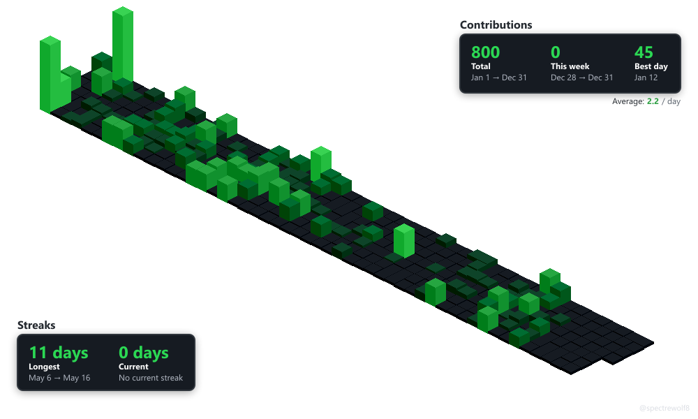
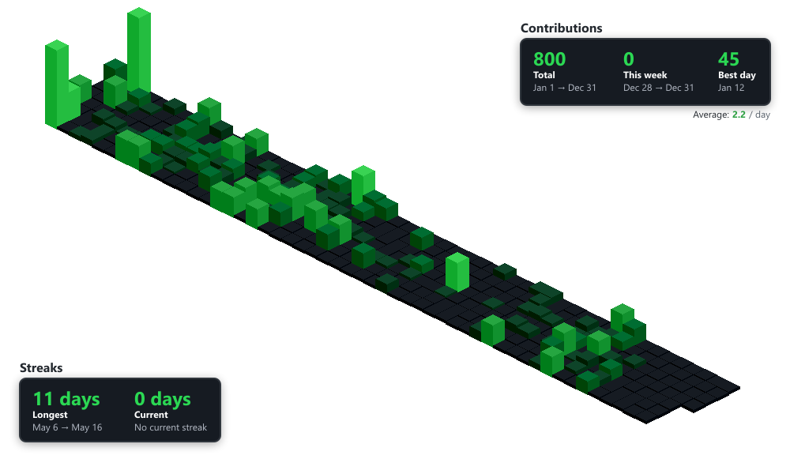
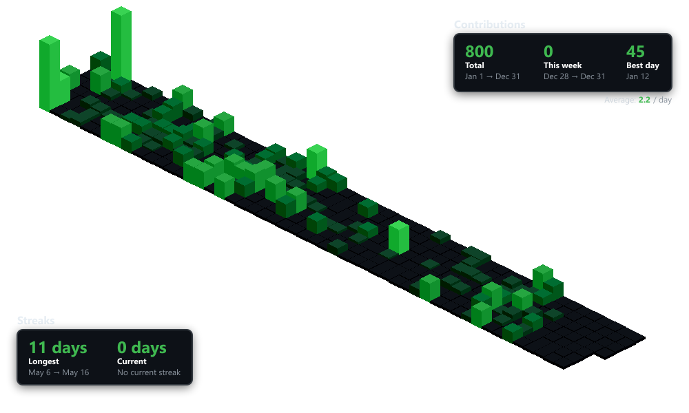
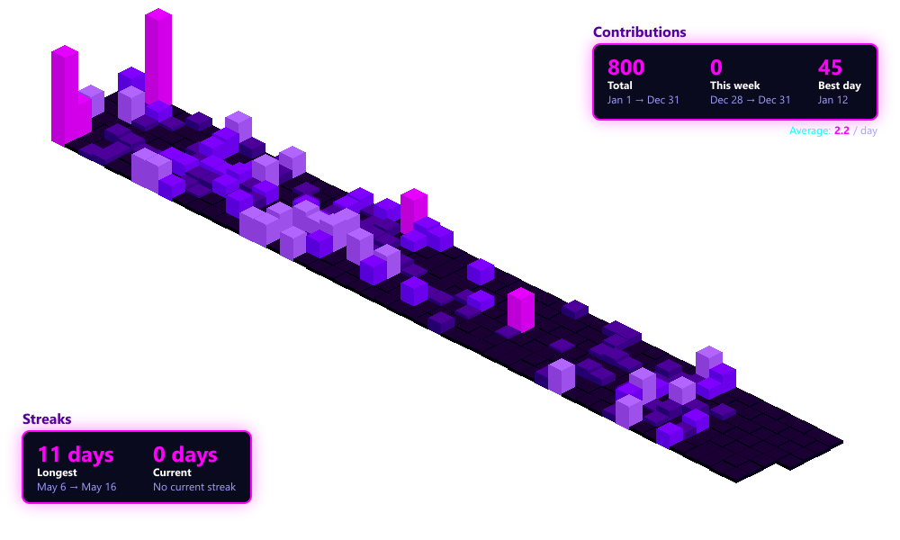
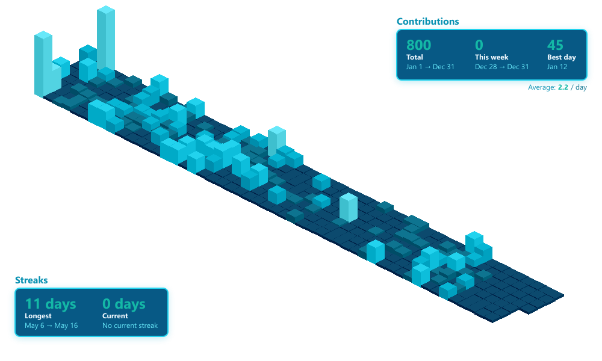
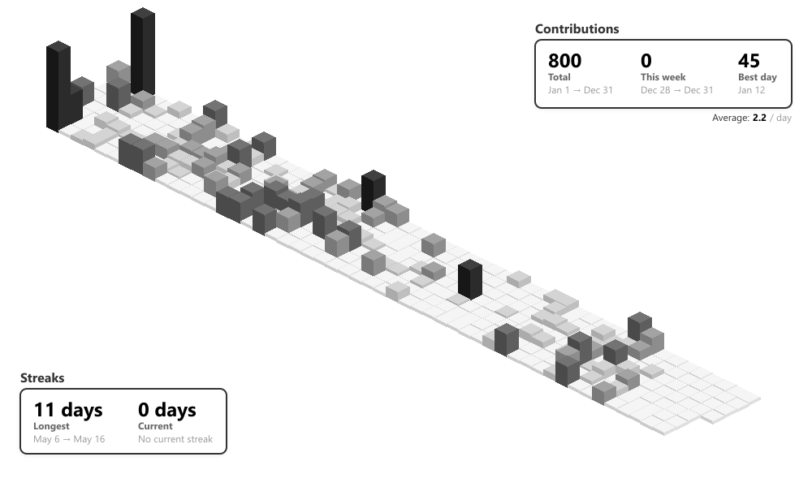
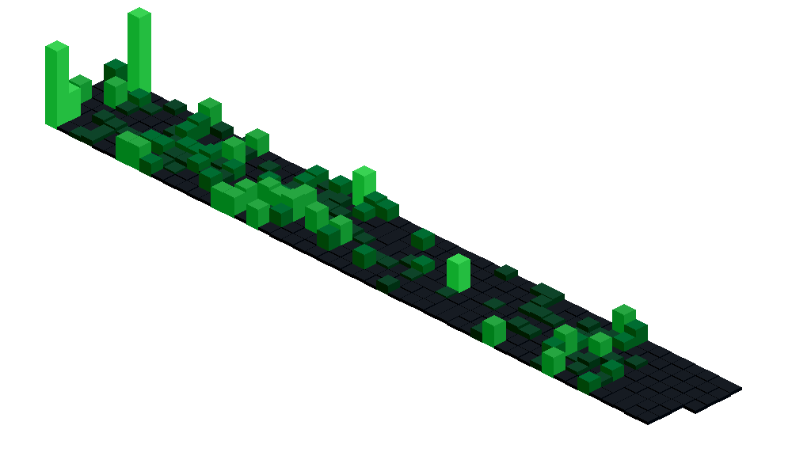
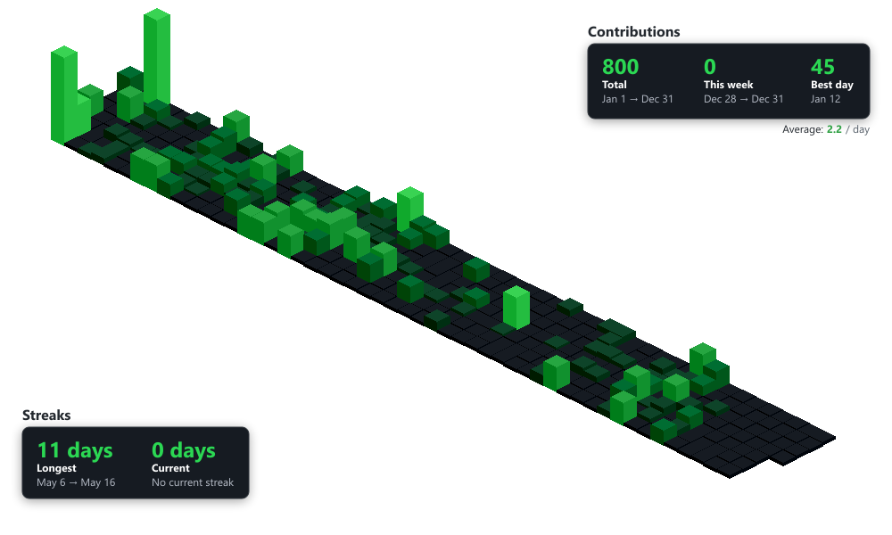
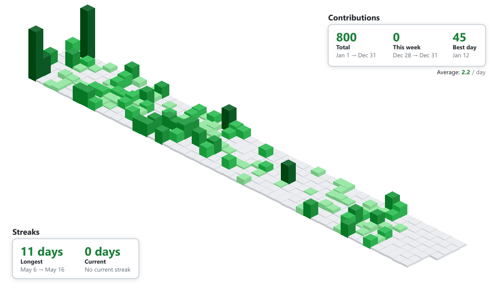

#  Isometric Contributions

Generate beautiful 3D isometric visualizations of GitHub contribution graphs. Available as both a CLI tool and a fast, cached API server.

## Examples

<table>
  <tr>
    <td align="center">
      <br/>
      <b>Default</b>
    </td>
    <td align="center">
      <br/>
      <b>GitHub Theme</b>
    </td>
    <td align="center">
      <br/>
      <b>Dark Theme</b>
    </td>
  </tr>
  <tr>
    <td align="center">
      <br/>
      <b>Neon Theme</b>
    </td>
    <td align="center">
      <br/>
      <b>Ocean Theme</b>
    </td>
    <td align="center">
      <br/>
      <b>Minimal Theme</b>
    </td>
  </tr>
  <tr>
    <td align="center">
      <br/>
      <b>Without Stats</b>
    </td>
    <td align="center">
      <br/>
      <b>Without Credit</b>
    </td>
    <td align="center">
      <br/>
      <b>Light Theme</b>
    </td>
  </tr>
</table>

## Features

- ⚡ **Fast API** with intelligent caching and revalidation
- 🎨 **6 Built-in Themes**: GitHub, Dark, Light, Neon, Minimal, Ocean
- 📊 **Statistics Overlay**: Contributions, streaks, averages
- 🖼️ **Customizable**: Dimensions, year selection, credits, themes
- 🚀 **Minimal**: Lightweight with no framework overhead
- 💾 **Smart Caching**: Efficient daily caching with instant updates
- 🎯 **Single Year Focus**: Clean graphs for one year at a time
- 🐳 **Docker Ready**: Easy deployment on Render, Railway, or any platform

## Installation

```bash
npm install
```

## Quick Start

### CLI Usage

Generate an isometric contribution graph:

```bash
npm run generate -- <username> [year] [output] [options]
```

**Examples:**

```bash
# Basic usage
npm run generate -- spectrewolf8

# Specific year with stats
npm run generate -- spectrewolf8 2025 graph.png --stats --credit

# Custom dimensions
npm run generate -- spectrewolf8 2025 graph.png --width 1920 --height 1080
```

**CLI Options:**

- `--stats` - Include statistics overlay
- `--credit` - Show username in bottom right
- `--theme <name>` - Visual theme: `github`, `dark`, `light`, `neon`, `minimal`, `ocean` (default: github)
- `--width <px>` - Canvas width (default: 1000)
- `--height <px>` - Canvas height (default: 600)

### API Server

Start the API server for web integration:

```bash
npm run server
```

Or with auto-reload during development:

```bash
npm run dev
```

Server runs on port 3000 (configurable via `PORT` environment variable).

## API Documentation

### Endpoint

```
GET /api/graph
```

### Query Parameters

| Parameter  | Type    | Required | Default      | Description                                                         |
| ---------- | ------- | -------- | ------------ | ------------------------------------------------------------------- |
| `username` | string  | ✅ Yes   | -            | GitHub username                                                     |
| `year`/`y` | number  | No       | current year | Year to fetch contributions for (supports aliases)                  |
| `theme`    | string  | No       | `github`     | Visual theme: `github`, `dark`, `light`, `neon`, `minimal`, `ocean` |
| `width`    | number  | No       | `1000`       | Image width in pixels                                               |
| `height`   | number  | No       | `600`        | Image height in pixels                                              |
| `stats`    | boolean | No       | `false`      | Include statistics overlay                                          |
| `credit`   | boolean | No       | `false`      | Show username credit                                                |

### API Examples

**Basic Graph:**

```
https://your-app.onrender.com/api/graph?username=spectrewolf8
```

**With Statistics:**

```
https://your-app.onrender.com/api/graph?username=spectrewolf8&stats=true
```

**Specific Year:**

```
https://your-app.onrender.com/api/graph?username=spectrewolf8&year=2025
```

**With Theme:**

```
https://your-app.onrender.com/api/graph?username=spectrewolf8&theme=dark&stats=true
```

**With Credit:**

```
https://your-app.onrender.com/api/graph?username=spectrewolf8&credit=true
```

**Full Customization:**

```
https://your-app.onrender.com/api/graph?username=spectrewolf8&year=2025&width=1200&height=700&stats=true&credit=true&theme=neon
```

> **Note:** Replace `your-app.onrender.com` with your actual deployment URL. Use `http://localhost:3000` for local testing.

### Caching

The API implements intelligent daily caching:

- **Cache Duration**: 1 hour with revalidation (ensures freshness)
- **Cache Strategy**: One generation per username+params per day
- **Cache Headers**: Check `X-Cache` header (`HIT` or `MISS`)
- **Validation**: Uses `Last-Modified` and `ETag` headers for cache revalidation
- **Benefits**: Instant responses for repeated requests with fresh updates

**Cache Response Headers:**

```
Content-Type: image/png
Cache-Control: public, max-age=3600, must-revalidate
Last-Modified: <file-modification-time>
ETag: "<timestamp>-<size>"
X-Cache: HIT | MISS
```

### Additional Endpoints

**Documentation:**

```
GET /
GET /docs
```

**Health Check:**

```
GET /health
```

## Programmatic Usage

### Fetch Contributions

```javascript
import {
  fetchContributions,
  parseContributionsData,
} from "./src/api-client.js";

const data = await fetchContributions("username", 2025);
const days = parseContributionsData(data);
```

### Render Image

```javascript
import { renderIsometricChart, exportToPNG, setTheme } from "./src/renderer.js";
import { DARK_THEME } from "./src/theme-config.js";
import { writeFileSync } from "fs";

// Set theme (optional)
setTheme(DARK_THEME);

// Render
const canvas = renderIsometricChart(days, {
  width: 1000,
  height: 600,
  username: "spectrewolf8", // optional credit
});

// Export
const buffer = await exportToPNG(canvas);
writeFileSync("output.png", buffer);
```

### With Statistics

```javascript
import { renderWithStats } from "./src/renderer.js";

const canvas = renderWithStats(days, {
  width: 1000,
  height: 600,
});
```

### Available Themes

```javascript
import {
  GITHUB_THEME,
  DARK_THEME,
  LIGHT_THEME,
  NEON_THEME,
  MINIMAL_THEME,
  OCEAN_THEME,
} from "./src/theme-config.js";
import { setTheme } from "./src/renderer.js";

// Apply theme before rendering
setTheme(NEON_THEME);
```

## Deployment

### Deploy on Render (Recommended)

This project is optimized for Render deployment with Docker support.

**Quick Deploy:**

1. Push to GitHub
2. Create new Web Service on [Render](https://render.com)
3. Connect your repo and select **Docker** environment
4. Add environment variables:
   - `SUPABASE_URL`
   - `SUPABASE_ANON_KEY`
   - `SUPABASE_BUCKET_NAME`
5. Deploy!

📖 **Detailed instructions:** See [RENDER_DEPLOYMENT.md](RENDER_DEPLOYMENT.md)

**Why Docker?**
The `canvas` package requires system libraries (Cairo, Pango) that are automatically installed via the Dockerfile.

### Other Platforms

The Docker setup works on any platform supporting Docker:

- Railway
- Fly.io
- Google Cloud Run
- AWS ECS/Fargate
- Azure Container Apps

## Embedding in README

### Markdown

```markdown

```

**With theme:**

```markdown

```

### HTML

```html

```

## Scripts

| Command            | Description                   |
| ------------------ | ----------------------------- |
| `npm run generate` | Generate graph via CLI        |
| `npm run server`   | Start API server              |
| `npm run dev`      | Start server with auto-reload |
| `npm run test:api` | Test API endpoints            |

## Output

Generates PNG images with:

- **Resolution**: Customizable (default 1000x600)
- **Format**: PNG with transparency
- **Size**: ~20-30 KB (varies with dimensions)

### Statistics Displayed

- Total contributions
- Best day (max contributions)
- Average per day
- Longest streak
- Current streak

## Cache Management

**Clear Cache:**

```bash
# Windows
rmdir /s /q .cache

# Linux/Mac
rm -rf .cache
```

**Cache Location:** `.cache/` directory
**Cache Size:** ~100-200KB per cached image

## Troubleshooting

**Clear Cache:**

```bash
rm -rf .cache && npm run server
```

## Acknowledgements

This project builds upon the excellent work of:

- **Core Renderer**: Based on [isometric-contributions](https://github.com/jasonlong/isometric-contributions) by Jason Long - the foundational isometric rendering logic was taken and modified for this implementation
- **Contributions API**: Uses the [GitHub Contributions API](https://github.com/grubersjoe/github-contributions-api) by Joe Gruber - an unofficial but reliable API for fetching GitHub contribution data

## Contributing

Feel free to open issues or submit PRs for improvements!

## License

This project is licensed under the [MIT License](http://opensource.org/licenses/MIT).
